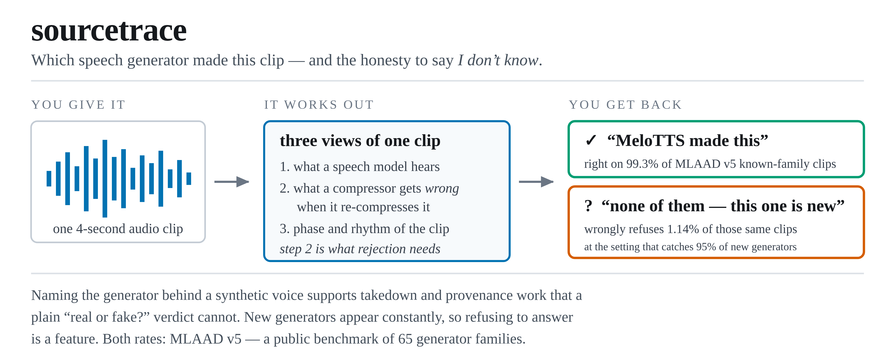

<p align="center">
  <picture>
    <source media="(prefers-color-scheme: dark)" srcset="assets/readme/hero-dark.png">
    
  </picture>
</p>

# sourcetrace

*Front-End Evidence and Calibrated Abstention for Open-Set Audio Deepfake Attribution*


[](https://huggingface.co/RootAccess4Life/ood-source-tracing)

> 📦 Checkpoints: **[RootAccess4Life/ood-source-tracing](https://huggingface.co/RootAccess4Life/ood-source-tracing)**
> — [`mlaad_v5.pt`](https://huggingface.co/RootAccess4Life/ood-source-tracing/blob/main/mlaad_v5.pt)
> is the artifact of record for every number below &nbsp;·&nbsp;
> [`stopa.pt`](https://huggingface.co/RootAccess4Life/ood-source-tracing/blob/main/stopa.pt)
> is the second corpus.
> Both are sha256-pinned in `scripts/download_weights.py`; fetch with
> `python scripts/download_weights.py`.

**Given a synthetic speech clip, name which generator produced it — or report that
the generator is not one it has seen.** That second answer is the point: new systems
appear constantly, and an attribution nobody can trust is worse than none.

A **frozen** WavLM-Large front-end, no fine-tuning, just a small head. The
distinguishing ingredient is a **codec reconstruction residual**: squeeze a clip
through EnCodec-24 kHz, pull it back, and keep what it got *wrong*. Those 33 numbers
come off the waveform the speech model never sees.

**FPR95 1.14 % against a published 3.36 % · closed-set accuracy 99.34 % · STOPA
unknown-attack EER 9.33 %.** And the two places it does not win: **deleting the codec
channel improves OOD-EER** (3.02 against 3.66) **and closed-set accuracy** (99.45
against 99.34) — the channel buys rejection at the 95 %-recall operating point and
nothing else — and **the shipped SSL layer band is not the best one**, with layers 1–4
scoring 0.78 FPR95 against the shipped band's 1.07 ([table](#results)).

```bash
git clone https://github.com/pujariaditya/sourcetrace && cd sourcetrace
conda create -n sourcetrace python=3.10 && conda activate sourcetrace
pip install -e . && ./setup.sh
python scripts/smoke.py              # 20 s, no download: check the install
```

Export `PYTHONNOUSERSITE=1` in that environment — a newer `huggingface_hub` in
`~/.local` shadows the pinned one and breaks the pinned `transformers`. Run from the
repository root; every entry point checks the interpreter first and says so when it is
wrong.

`smoke.py` exercises fit → embed → open-set score → save → reload on a tiny synthetic
matrix, so a broken install fails in seconds instead of after a 242 GB download. It
says nothing about accuracy; `./scripts/verify_results.sh` is what does.

## Results

On **MLAAD v5**, family-level open set: 65 known families, 9,620 evaluation trials,
split seed 42 / fit seed 0.

| metric | this repo | published |
|---|---|---|
| FPR95 ↓ | **1.14 %** | 3.36 % |
| OOD-EER ↓ | 3.66 % | — |
| closed-set accuracy ↑ | 99.34 % | — |

The published reference is PANDA / Neamtu et al.
([arXiv:2606.10758](https://arxiv.org/abs/2606.10758)) on the official v5 splits under
the same FPR95 definition. They report no OOD-EER or closed-set accuracy, which is why
those rows have no reference rather than a favourable one.

**The codec channel is worth 1.554 FPR95 points and costs on both other axes.**
Deleting it moves FPR95 from 1.14 to 2.70, and at the same time *improves* OOD-EER to
3.02 and closed-set accuracy to 99.45. The claim is narrow and is the one made: it
improves *rejection*, not attribution (`results/ablation/no_codec.json`).

**The SSL layer band is the next largest effect, at 1.28 points — and the shipped band
loses it.** Layers 1–4 score 0.78 FPR95 against 1.07 for the shipped 4–7 and 2.06 for
8–11. The shipped band is what every published number and both checkpoints use; the
sweep prices the choice rather than claiming it was optimal
(`results/layer_band_summary.json`).

The conformal abstention rule reports measured coverage 96.11 % against a 95 % nominal
level (`results/reliability.json`).

On **STOPA** — a second corpus, 629,800 probe utterances, five unknown attacks — the
same head, fitted on STOPA's EET split, scores **9.33 %** unknown-attack EER against
mid-30s to near 50 % for STOPA's own trained baselines. **No margin is claimed over the
lower published 16.43 %**: that is a *zero-shot* system, a different setting, and
`evaluate` prints `n/c` rather than a win (`results/stopa_measured.json`).

Every number is single-seed. None of these margins is a measured effect size.

## Reproduce the table

```bash
python scripts/download_weights.py                        # both heads, sha256-pinned
python scripts/fetch_mlaad.py                             # ~242 GB of audio
python -m sourcetrace.extract --dataset mlaad_v5          # audio -> 2133-d features
python -m sourcetrace.evaluate --task mlaad_v5 \
    --checkpoint checkpoints/mlaad_v5.pt --json runs/my_run.json
```

Write your own runs to `runs/`, not `results/` — that directory is the committed
record the paper cites, and a re-run that overwrote it in place would leave no way to
tell a reproduction from the original.

Downloading a checkpoint saves the ~35–40 minute fit and nothing else; evaluation
still reads the feature cache built above. To refit instead, drop `--checkpoint`, or
use `python -m sourcetrace.train`. `./scripts/verify_results.sh` runs the whole chain
end to end, and `./scripts/run_ablations.sh` reproduces the six-arm ablation table
(6 × ~35–40 min).

Paths are environment-driven, never hardcoded: `ST_DATA_ROOT`, `ST_MLAAD_ROOT`,
`ST_STOPA_ROOT`, `ST_FEATURE_CACHE`, `ST_MODEL_CACHE`, and `ST_CPU=1` to force CPU.
Hyperparameters come from `configs/` — `configs/base.yaml` is the frozen champion
configuration and is checked to be identical to the code's own defaults.

## Citation

See [`CITATION.cff`](CITATION.cff). Please also cite the benchmarks — MLAAD
([mueller91/MLAAD](https://huggingface.co/datasets/mueller91/MLAAD)) and STOPA
([10.5281/zenodo.15606628](https://doi.org/10.5281/zenodo.15606628)) — and the
baselines compared against: Neamtu et al.
([arXiv:2606.10758](https://arxiv.org/abs/2606.10758)) and Chhibber et al.
([arXiv:2509.24674](https://arxiv.org/abs/2509.24674)).

## Licence

MIT (`LICENSE`). MLAAD and STOPA carry their own terms; this repository redistributes
no audio and no weights.
